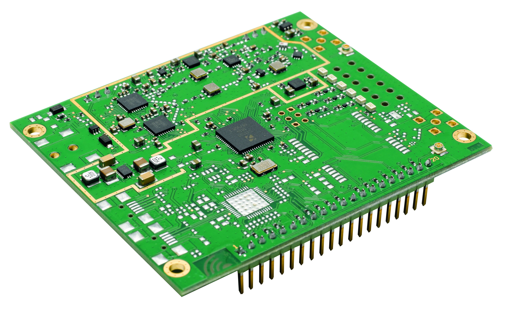

# iC880A-SPI Concatenator

* [Datenblatt](../../Medien/PDFs/iC880A_Datasheet_V1_1.pdf)
* [Schnellstartanleitung](../../Medien/PDFs/iC880A-SPI_QuickStartGuide.pdf)
* [ttn-zh Anleitung Github](https://github.com/ttn-zh/ic880a-gateway/wiki)
  * [Lokale Kopie](../../Medien/Other/ttn-zh%20Anleitung.md)
* The iC880A is able to receive up to 8 LoRa® packets simultaneously sent with different spreading factors and also on different channels. This unique capability allows to implement innovative network architectures advantageous over other short range systems.
* -5°C to +55°C
* 5 V
* The LoRa® MAC specification is currently driven by the [LoRa® Alliance](https://www.lora-alliance.org/). All available software, firmware and documentation can be found and downloaded from the open source project LoRa-net. It is highly recommended to fully re-use the latest HAL as provided by Semtech® on [Github](https://github.com/Lora-net).

## Screenshots

