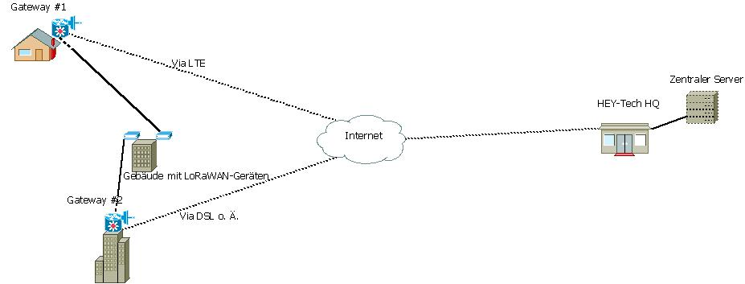

# Aufbau eines LoRaWAN-Netzes

* Sterntopologie
* Mehrere [Gateways](Gateways/Gateways%20Allgemein.md) in verschiedenen Objekten
* [Gateways](Gateways/Gateways%20Allgemein.md) mit [zentralem Server](Zentraler%20Server/Zentraler%20Server.md) verbunden (via Internet)
* [Zentraler Server](Zentraler%20Server/Zentraler%20Server.md) besteht aus [Anwendungsserver](Zentraler%20Server/Anwendungsserver.md) (Application server) und *Netzwerkserver* (Network server)
* Mehrere *Nodes* (Endgeräte, LoRaWAN-Geräte) die Daten an Gateways senden

## Grober Beispielaufbau

Es wäre im obigen Beispiel auch gut möglich, dass die beiden *Nodes* Daten an beide *Gateways* gleichzeitig senden — der LoRaWAN-Netzwerkserver würde die Daten in diesem Falle „deduplizieren“, also die mehrfach auftretenden Datensätze löschen, 
